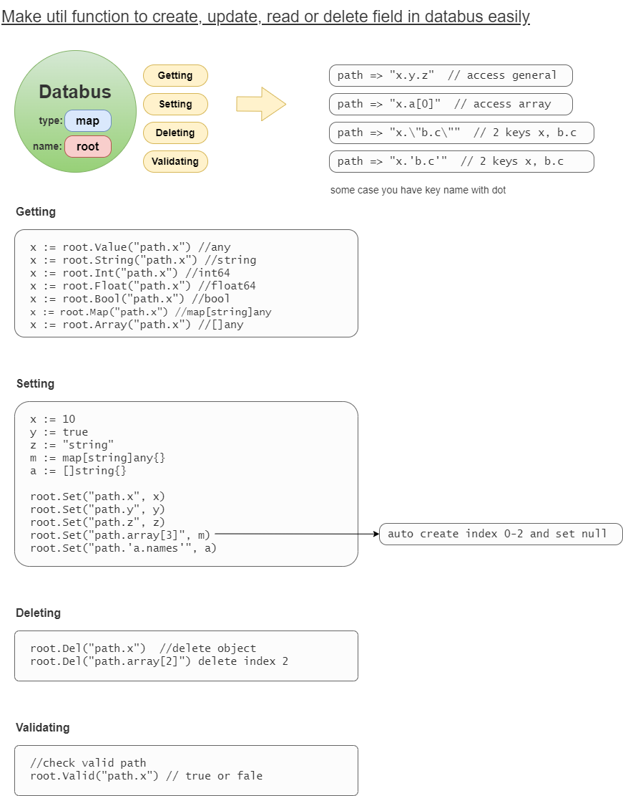

# godatabus
This project to change go map query data very easy





Example Code:
```
// Read JsonMap from FIle
file := "./sample/test_databus.json"
data := JsonMap(file)

// New Databus
root := bus.NewBusWithMap(&data)

// Reading
str := root.String("id")
num := root.Int("id")
strL := root.String("list[2]")

// Set Data to Array
root.Set("list[5]", "buffalo")
list := root.Value("list")

root.Set("myList[0].a", "aaa")
root.Set("myList[0].b", "bbb")
root.Set("myList[0].c", "ccc")
root.Set("myList[0].d", "ddd")
myList := root.Value("myList")

// Set Data if key has dot such as x.y.z
root.Set("'x.y.z'", "XYZ")
xyz := root.String("'x.y.z'")


```